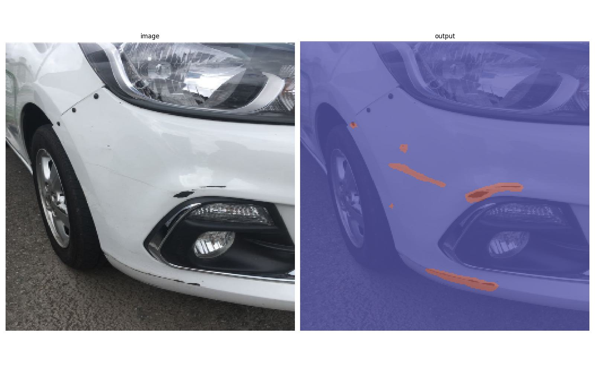

# Car_damage_segment

 

  

## Object

 

- 차량 파손 시 해당 부분을 이미지로 촬영하여 간단히 파손 종류 및 면적에 따른 수리가격을 책정합니다.

- 또한 수리가격에 대한 면적 및 가격 책정 기준을 시각적인 자료로 공유합니다.

- 만약 해당 모델이 서비스화 된다면 간단한 사진 촬영만으로 수리 비용을 계산할 수 있을 것입니다. 

  

## Dataset

 

- [AI허브] 차량 파손 이미지 : https://www.aihub.or.kr/aihubdata/data/view.do?dataSetSn=581

  

## 사전 학습 모델

 

- [DAMAGE][Breakage_3]Unet.pt : 파손
- [DAMAGE][Crushed_2]Unet.pt : 찌그러짐
- [DAMAGE][Scratch_0]Unet.pt : 스크래치
- [DAMAGE][Seperated_1]Unet.pt : 이격

  

## Version

 

- pandas==1.3.4
- opencv-python==4.5.4.60
- torch==1.10.1
- segmentation-models-pytorch==0.2.1
- albumentations==1.1.0
- pytz==2021.3

  

# Feedback

 

- 쏘카 서비스와 같이 Mobile 환경에서의 사진 전송에 대한 부분은 미흡
  
- 차종, 보험 등 가격 책정에 대한 정확한 기준이 모호하여 본 모델에서는 아래와 같이 계산하였습니다.

   : 파손면적 * 파손 분류 별 단가

